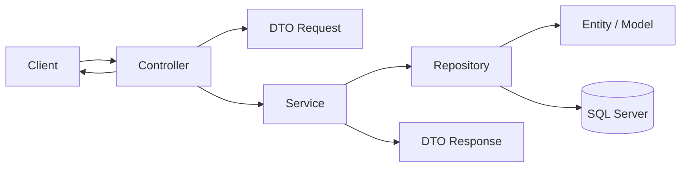

# 🏗️ Kiến trúc dự án (Architecture Overview)

Dự án này là hệ thống Backend quản lý bãi đỗ xe thông minh (Parking Management System) sử dụng framework **Spring Boot** kết hợp cơ sở dữ liệu **Microsoft SQL Server**.

---

## 🚀 Công nghệ sử dụng (Tech Stack)

* **Framework chính:** Spring Boot v3.2.5
* **Java SDK:** Java 17
* **Quản lý dependencies:** Maven
* **Cơ sở dữ liệu:** SQL Server (sử dụng Spring Data JPA + Hibernate)
* **Bảo mật:** Spring Security + JSON Web Token (JWT v0.12.5) để phân quyền & chứng thực
* **Thư viện tiện ích:**
  * **Lombok:** Tự động sinh Getter/Setter, Constructor, Builder,...
  * **ModelMapper:** Map dữ liệu từ Entity sang DTO và ngược lại.
  * **Springdoc OpenAPI (Swagger UI):** Tự sinh tài liệu API để Frontend kết nối.
* **Tích hợp bên thứ ba:**
  * **Cloudinary:** Lưu trữ hình ảnh biển số xe/phương tiện.
  * **VNPay:** Tích hợp cổng thanh toán Sandbox qua giao thức URL + IPN.

---

## 📂 Cấu trúc thư mục mã nguồn (Folder Structure)

Mã nguồn được phân tách theo mô hình 3 lớp chuẩn (3-Tier Architecture):

```text
src/main/java/Parking/
├── Controller/      # Lớp kiểm soát các API Endpoint, tiếp nhận Request từ Client
├── Service/         # Lớp xử lý nghiệp vụ chính (Business Logic)
├── Repository/      # Lớp truy vấn dữ liệu từ SQL Server thông qua JPA/Hibernate
├── Model/           # Lớp thực thể cơ sở dữ liệu (Database Entities)
├── dto/             # Đối tượng truyền tải dữ liệu (Data Transfer Objects)
│   ├── request/     # DTO đầu vào của API
│   └── response/    # DTO trả về cho Client
├── enums/           # Định nghĩa các trạng thái (PaymentStatus, ParkingSessionStatus,...)
├── config/          # Cấu hình hệ thống (Security, Cloudinary, VNPay, Swagger,...)
├── Util/            # Các lớp hỗ trợ chuyển đổi dữ liệu (Mã hóa, Hash, sinh String)
├── exception/       # Quản lý và xử lý lỗi tập trung (Global Exception Handling)
└── Main.java        # Điểm khởi chạy của ứng dụng Spring Boot (Entry Point)
```

---

## 🔁 Luồng dữ liệu (Data Flow)

Mọi yêu cầu API từ Client (Frontend/Mobile) sẽ đi qua luồng dữ liệu chuẩn sau:



1. **Client** gửi một HTTP Request đến API Endpoint (định nghĩa trong `Controller`).
2. **Controller** tiếp nhận dữ liệu bằng các class trong thư mục `dto/request/`, xác thực định dạng đầu vào.
3. **Controller** gọi phương thức tương ứng trong **Service**.
4. **Service** thực hiện các nghiệp vụ tính toán (như tính phí gửi xe, kiểm tra thẻ,...), gọi **Repository** để đọc/ghi dữ liệu.
5. **Repository** thực thi SQL qua Hibernate tới **Database**.
6. Dữ liệu trả về từ Database được **Service** chuyển đổi thành các class trong thư mục `dto/response/` (sử dụng `ModelMapper` hoặc `@Builder`).
7. **Controller** nhận DTO kết quả từ **Service** và trả về định dạng JSON kèm theo HTTP Status Code phù hợp.
