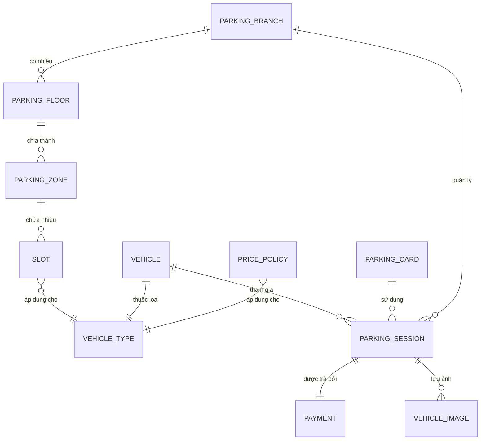

# 🗄️ Thiết kế Cơ sở dữ liệu (Database Schema)

Hệ thống sử dụng cơ sở dữ liệu quan hệ quản lý các thông tin từ Chi nhánh, Tầng đỗ, Vị trí (Slot) cho đến các lượt gửi xe (Session), hình ảnh phương tiện và giao dịch thanh toán.

---

## 📊 Sơ đồ Quan hệ Thực thể (Entity Relationship Diagram)

Dưới đây là sơ đồ Mermaid ERD mô tả mối quan hệ giữa các bảng chính trong hệ thống:

---

## 📝 Chi tiết các Bảng chính (Tables Details)

### 1. `parking_branch` (Chi nhánh bãi xe)
* Quản lý các cơ sở bãi đỗ xe khác nhau trong hệ thống.
* Quan hệ: Một chi nhánh có nhiều Tầng đỗ xe (`parking_floor`) và quản lý nhiều lượt gửi xe (`parking_session`).

### 2. `parking_floor` (Tầng đỗ xe)
* Quản lý thông tin tầng đỗ trong chi nhánh (Ví dụ: Tầng G, Tầng hầm B1, B2).
* Quan hệ: Thuộc về một `parking_branch`, chia thành nhiều Khu vực đỗ xe (`parking_zone`).

### 3. `parking_zone` (Khu vực đỗ xe)
* Phân chia không gian trong một tầng (Ví dụ: Khu A cho xe máy, Khu B cho ô tô).
* Quan hệ: Thuộc về một `parking_floor`, chứa nhiều Vị trí đỗ xe (`slot`).

### 4. `slot` (Vị trí đỗ xe cụ thể)
* Vị trí ô đỗ cụ thể được đánh số (Ví dụ: Slot A-01, Slot B-15).
* Quan hệ: Nằm trong `parking_zone`, giới hạn cho một loại phương tiện cụ thể (`vehicle_type`).

### 5. `vehicle_type` (Loại phương tiện)
* Định nghĩa loại xe: Xe máy (MOTORBIKE), Ô tô (CAR), Xe điện,...
* Quan hệ: Liên kết với chính sách giá (`price_policy`) và giới hạn vị trí đỗ (`slot`).

### 6. `price_policy` (Chính sách giá)
* Định nghĩa giá vé gửi xe cho từng loại phương tiện.
* Gồm các trường quan trọng:
  * `basePrice`: Giá tối thiểu cho thời gian gửi cơ bản.
  * `baseDurationMinutes`: Thời gian gửi cơ bản (Ví dụ: 120 phút).
  * `extraHourPrice`: Giá phụ thu cho mỗi giờ phát sinh thêm.

### 7. `vehicle` (Thông tin phương tiện)
* Lưu trữ biển số xe (`licensePlate`) và loại xe (`vehicle_type`).
* Quan hệ: Một xe có thể tham gia nhiều lượt gửi xe theo thời gian (`parking_session`).

### 8. `parking_card` (Thẻ gửi xe)
* Quản lý thẻ RFID vật lý cấp cho khách khi vào cổng (`cardCode`).
* Gồm trạng thái: `AVAILABLE` (sẵn sàng cấp), `IN_USE` (đang giữ xe).

### 9. `parking_session` (Phiên gửi xe)
* Trái tim của hệ thống, ghi lại toàn bộ hành trình gửi xe.
* Gồm các mốc thời gian: `checkInTime` (giờ vào), `checkOutTime` (giờ ra), `totalAmount` (tổng tiền thanh toán), và `status` (`ACTIVE` / `COMPLETED`).

### 10. `payment` (Giao dịch thanh toán)
* Chi tiết thanh toán của một phiên gửi xe.
* Gồm các thông tin: `paymentMethod` (`CASH` hoặc `VNPAY`), `paymentStatus` (`PENDING` / `PAID` / `FAILED`), và mã đối chiếu `transactionRef`.
