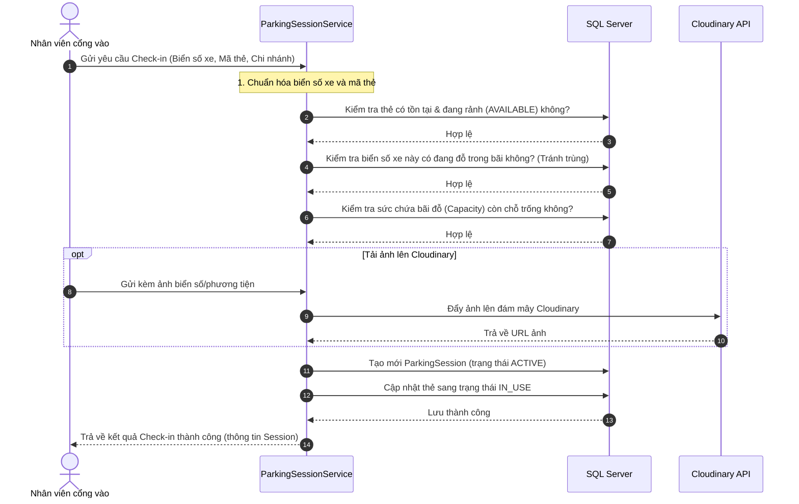
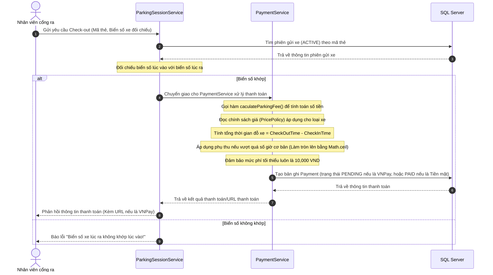
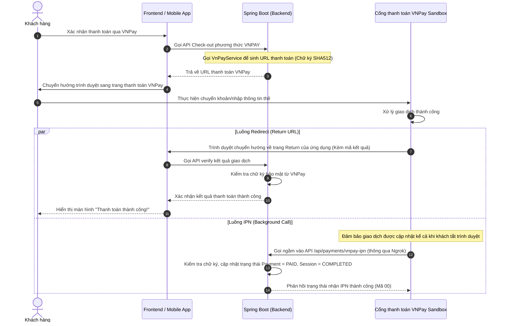

# 🔄 Quy trình Nghiệp vụ (Core Workflows)

Hệ thống có 3 quy trình cốt lõi chính: **Check-in (Xe vào)**, **Check-out & Tính phí (Xe ra)**, và **Tích hợp Thanh toán điện tử (VNPay)**.

---

## 📥 1. Quy trình Check-in (Xe vào)

Quy trình xe đi vào bãi đỗ và quét thẻ thành viên/thẻ lượt:

---

## 📤 2. Quy trình Check-out & Tính phí (Xe ra)

Quy trình tính toán thời gian, áp dụng chính sách giá và thực hiện thanh toán khi xe ra bãi:

---

## 💳 3. Tích hợp Thanh toán VNPay Sandbox

Khi khách chọn phương thức thanh toán là **VNPay**, hệ thống tạo URL thanh toán gửi về Client để khách quét mã hoặc nhập thẻ:

---

## 📷 4. Lưu trữ ảnh với Cloudinary

Hệ thống chụp và lưu trữ hình ảnh của xe lúc vào/ra để phục vụ mục đích kiểm tra an ninh và đối chiếu thủ công khi cần thiết. 
* Toàn bộ mã nguồn xử lý tích hợp nằm tại file [VehicleImageService.java](file:///D:/Ki7/SWP391/Index/Index/src/main/java/Parking/Service/VehicleImageService.java).
* Các bức ảnh tải lên dạng `MultipartFile` sẽ được truyền lên server của Cloudinary qua API của hãng, sau đó đường dẫn hình ảnh (`url`) sẽ được lưu trực tiếp vào bảng `vehicle_image` kết nối với `parking_session_id`.
