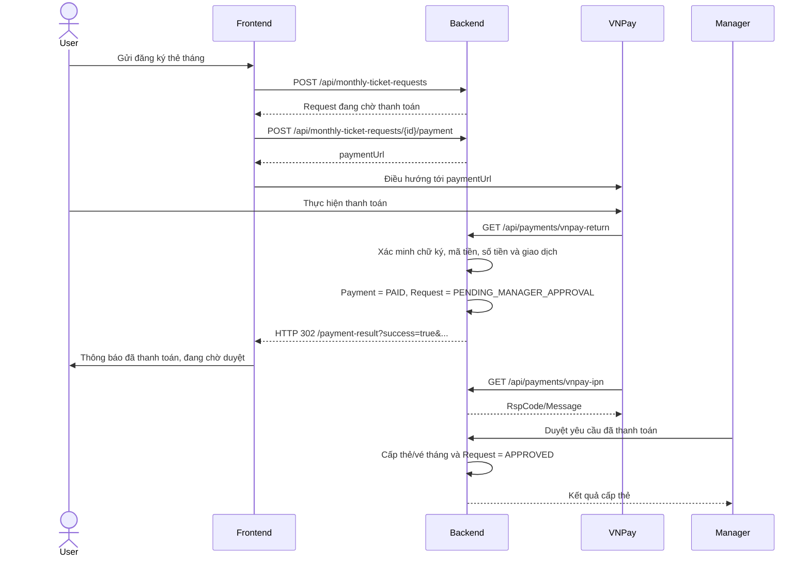

# Đồng bộ Backend và Frontend: Thanh toán đăng ký thẻ tháng

## 1. Mục tiêu

Tài liệu này là hợp đồng tích hợp giữa Backend và Frontend cho nghiệp vụ đăng ký thẻ tháng qua VNPay.

Quy trình nghiệp vụ được thống nhất như sau:

1. User gửi yêu cầu đăng ký thẻ tháng.
2. User thanh toán yêu cầu qua VNPay.
3. Backend xác nhận giao dịch và ghi nhận yêu cầu **đã thanh toán**.
4. Frontend thông báo rõ kết quả thanh toán cho user.
5. Yêu cầu đã thanh toán được chuyển sang hàng chờ Manager duyệt.
6. Manager duyệt và cấp thẻ/vé tháng cho user.

> Thanh toán thành công không đồng nghĩa với Manager đã duyệt và cũng chưa đồng nghĩa thẻ tháng đã được cấp.

---

## 2. Vấn đề hiện tại

### 2.1. VNPay đang có thể trả thẳng về Frontend

Trong `application.properties`, `vnpay.return-url` đang mặc định trỏ tới:

```properties
http://localhost:5173/payment-result
```

Khi đó endpoint Backend sau không được gọi:

```text
GET /api/payments/vnpay-return
```

Hậu quả:

- Backend không xử lý Return URL trên trình duyệt.
- Frontend không nhận được query `success` và `message` do Backend chuẩn hóa.
- IPN vẫn có thể cập nhật database nhưng không thể trực tiếp thông báo cho trình duyệt user.

### 2.2. Đang gộp “đã thanh toán” và “đã duyệt”

Sau khi VNPay trả mã thành công, Backend hiện gọi:

```java
monthlyTicketRequest.setStatus(1); // Approved
```

Điều này bỏ qua bước Manager duyệt. Backend phải lưu riêng trạng thái thanh toán và trạng thái xét duyệt.

### 2.3. Dữ liệu redirect chưa đủ để Frontend đối chiếu

Redirect hiện chỉ có:

```text
success
message
```

Frontend cần thêm ít nhất `paymentType`, `transactionRef` và `requestId` để hiển thị đúng nghiệp vụ và tải lại trạng thái yêu cầu.

---

## 3. Luồng chuẩn cần triển khai



Return URL phục vụ trải nghiệm trên trình duyệt. IPN là nguồn xác nhận server-to-server và phải xử lý idempotent. Cả hai đường gọi không được tạo dữ liệu trùng hoặc làm lùi trạng thái đã xác nhận.

---

## 4. Mô hình trạng thái thống nhất

Backend nên tách hai trường sau.

### 4.1. Trạng thái thanh toán (`paymentStatus`)

Sử dụng enum hiện có:

| Giá trị | Ý nghĩa |
|---|---|
| `PENDING` | Đã tạo giao dịch, chưa xác nhận thanh toán |
| `PAID` | VNPay đã xác nhận thanh toán thành công |
| `FAILED` | Thanh toán thất bại hoặc bị hủy |

### 4.2. Trạng thái xét duyệt (`approvalStatus`)

Không tiếp tục dùng một số `status = 1` cho cả thanh toán và phê duyệt. Khuyến nghị dùng enum dạng chuỗi:

| Giá trị | Ý nghĩa |
|---|---|
| `PENDING_PAYMENT` | User chưa thanh toán thành công |
| `PENDING_MANAGER_APPROVAL` | Đã thanh toán, đang chờ Manager duyệt |
| `APPROVED` | Manager đã duyệt và cấp thẻ/vé tháng |
| `REJECTED` | Manager từ chối; phải lưu lý do |

Nếu chưa thể migration sang enum chuỗi, hai bên phải thống nhất tạm mapping số:

| Số | Giá trị |
|---:|---|
| `0` | `PENDING_PAYMENT` |
| `1` | `PENDING_MANAGER_APPROVAL` |
| `2` | `APPROVED` |
| `3` | `REJECTED` |

> Khi đổi mapping, cần migration dữ liệu cũ. Không được tự hiểu toàn bộ bản ghi `status = 1` cũ là đã thanh toán hoặc đã được Manager duyệt nếu chưa đối chiếu bảng `payments`.

---

## 5. Thay đổi Backend

### 5.1. Sửa cấu hình Return URL

Local:

```properties
app.frontend.url=${APP_FRONTEND_URL:http://localhost:5173}
vnpay.return-url=${VNPAY_RETURN_URL:http://localhost:8081/api/payments/vnpay-return}
vnpay.ipn-url=${VNPAY_IPN_URL:https://public-backend-domain/api/payments/vnpay-ipn}
```

Production:

```env
APP_FRONTEND_URL=https://frontend-domain
VNPAY_RETURN_URL=https://backend-domain/api/payments/vnpay-return
VNPAY_IPN_URL=https://backend-domain/api/payments/vnpay-ipn
```

`VNPAY_RETURN_URL` và `VNPAY_IPN_URL` phải là URL Backend HTTPS công khai. Không cấu hình Return URL trỏ thẳng tới Frontend.

### 5.2. Xử lý callback thành công

Khi `vnp_ResponseCode = 00` và toàn bộ dữ liệu hợp lệ:

```text
Payment.paymentStatus = PAID
Payment.paidAt = thời điểm hiện tại
MonthlyTicketRequest.approvalStatus = PENDING_MANAGER_APPROVAL
```

Không tạo `MonthlyTicket` và không đặt request thành `APPROVED` ở bước callback thanh toán.

Backend phải kiểm tra cả:

- Chữ ký VNPay.
- `vnp_TmnCode`.
- `vnp_TxnRef` tồn tại.
- `vnp_Amount` bằng `Payment.amount`.
- Giao dịch thuộc loại `MONTHLY_TICKET`.
- Payment chưa hết hạn theo chính sách của hệ thống.
- Callback/IPN lặp lại được xử lý idempotent.

### 5.3. Redirect về Frontend

Backend redirect về:

```text
{APP_FRONTEND_URL}/payment-result
    ?success=true
    &paymentType=MONTHLY_TICKET
    &transactionRef=TXN_MT_...
    &requestId=123
    &message=Thanh%20toán%20thành%20công.%20Yêu%20cầu%20đang%20chờ%20Manager%20duyệt.
```

Trường hợp thất bại:

```text
{APP_FRONTEND_URL}/payment-result
    ?success=false
    &paymentType=MONTHLY_TICKET
    &transactionRef=TXN_MT_...
    &requestId=123
    &message=Thanh%20toán%20không%20thành%20công.
```

Không đưa thông tin nhạy cảm, chữ ký VNPay hoặc dữ liệu ngân hàng lên URL Frontend.

### 5.4. Response tạo thanh toán

Endpoint:

```http
POST /api/monthly-ticket-requests/{requestId}/payment
```

Response đề xuất:

```json
{
  "requestId": 123,
  "paymentId": 456,
  "transactionRef": "TXN_MT_...",
  "paymentStatus": "PENDING",
  "paymentUrl": "https://sandbox.vnpayment.vn/...",
  "expiresAt": "2026-07-14T10:30:00+07:00"
}
```

Backend phải xác nhận request thuộc user hiện tại. User không được tạo thanh toán cho request của tài khoản khác.

Nếu payment cũ đang `PENDING` và còn hạn, có thể trả lại URL hiện tại. Nếu đã hết hạn hoặc `FAILED`, Backend phải cho phép tạo lượt thanh toán mới một cách có kiểm soát, không vi phạm unique constraint.

### 5.5. Response yêu cầu thẻ tháng

API `GET /api/monthly-ticket-requests/my-requests` và API dành cho Manager phải trả DTO ổn định, không trả trực tiếp JPA entity.

Response đề xuất:

```json
{
  "requestId": 123,
  "vehicleId": 10,
  "licensePlate": "30A-12345",
  "policyId": 5,
  "branchId": 2,
  "amount": 500000,
  "paymentStatus": "PAID",
  "approvalStatus": "PENDING_MANAGER_APPROVAL",
  "paidAt": "2026-07-14T10:15:30",
  "createdAt": "2026-07-14T10:00:00",
  "rejectionReason": null
}
```

Manager chỉ được thấy và duyệt request thuộc phạm vi chi nhánh mình quản lý.

### 5.6. API Manager duyệt

Khuyến nghị tách endpoint nghiệp vụ rõ ràng:

```http
POST /api/monthly-ticket-requests/{requestId}/approve
```

Backend chỉ cho duyệt khi:

- `paymentStatus = PAID`.
- `approvalStatus = PENDING_MANAGER_APPROVAL`.
- Manager có quyền với chi nhánh của request.
- Xe, chính sách, thẻ được cấp và thời hạn vẫn hợp lệ.

Sau khi cấp thẻ/vé thành công, cập nhật request thành `APPROVED` trong cùng transaction.

Endpoint từ chối:

```http
POST /api/monthly-ticket-requests/{requestId}/reject
```

Request body:

```json
{
  "reason": "Thông tin phương tiện không hợp lệ"
}
```

Quy trình hoàn tiền khi Manager từ chối một request đã thanh toán phải được quy định riêng; không tự động đánh dấu `Payment` thành `FAILED` vì giao dịch thực tế đã thu tiền.

---

## 6. Thay đổi Frontend

### 6.1. Điều hướng sang VNPay

Sau khi nhận response tạo thanh toán:

```javascript
window.location.assign(response.paymentUrl);
```

Không tự kết luận đã thanh toán ngay khi nhận được `paymentUrl`.

### 6.2. Trang `/payment-result`

Trang phải đọc các query:

```javascript
const params = new URLSearchParams(window.location.search);
const success = params.get("success") === "true";
const paymentType = params.get("paymentType");
const requestId = params.get("requestId");
const message = params.get("message");
```

Nếu `paymentType === "MONTHLY_TICKET"` và `success === true`, hiển thị:

```text
Thanh toán thành công
Yêu cầu đăng ký thẻ tháng của bạn đã được thanh toán và đang chờ Manager duyệt.
```

Không hiển thị “Đăng ký thẻ tháng thành công” hoặc “Thẻ đã được cấp” tại bước này.

Sau khi hiển thị kết quả, Frontend nên gọi lại:

```http
GET /api/monthly-ticket-requests/my-requests
```

để lấy trạng thái đáng tin cậy từ Backend. Query redirect chỉ dùng để hỗ trợ điều hướng và thông báo ban đầu, không phải nguồn dữ liệu cuối cùng.

### 6.3. Xử lý trạng thái trên giao diện User

| `paymentStatus` | `approvalStatus` | Nội dung hiển thị |
|---|---|---|
| `PENDING` | `PENDING_PAYMENT` | Chưa thanh toán / Tiếp tục thanh toán |
| `FAILED` | `PENDING_PAYMENT` | Thanh toán thất bại / Thử lại |
| `PAID` | `PENDING_MANAGER_APPROVAL` | Đã thanh toán – Đang chờ Manager duyệt |
| `PAID` | `APPROVED` | Đã duyệt – Thẻ/vé tháng đã được cấp |
| `PAID` | `REJECTED` | Bị từ chối – Hiển thị lý do và hướng dẫn hoàn tiền |

### 6.4. Xử lý user đóng tab trước khi redirect

Frontend không được phụ thuộc hoàn toàn vào trang `/payment-result`. Khi user quay lại dashboard hoặc trang lịch sử yêu cầu, luôn gọi API `my-requests` để lấy trạng thái do IPN đã cập nhật.

---

## 7. Quy ước lỗi API

Response lỗi thống nhất:

```json
{
  "timestamp": "2026-07-14T10:20:00",
  "status": 400,
  "code": "MONTHLY_TICKET_PAYMENT_INVALID_STATE",
  "message": "Yêu cầu này không ở trạng thái có thể thanh toán"
}
```

Các mã lỗi tối thiểu:

| HTTP | `code` | Ý nghĩa |
|---:|---|---|
| 400 | `MONTHLY_TICKET_PAYMENT_INVALID_STATE` | Request không thể thanh toán ở trạng thái hiện tại |
| 403 | `MONTHLY_TICKET_REQUEST_FORBIDDEN` | Request không thuộc user/branch được phép |
| 404 | `MONTHLY_TICKET_REQUEST_NOT_FOUND` | Không tìm thấy request |
| 409 | `MONTHLY_TICKET_PAYMENT_ALREADY_PAID` | Giao dịch đã thanh toán |
| 409 | `MONTHLY_TICKET_REQUEST_ALREADY_PROCESSED` | Manager đã xử lý request |
| 502 | `VNPAY_CALLBACK_INVALID` | Dữ liệu callback VNPay không hợp lệ |

Frontend ưu tiên xử lý theo `code`, còn `message` dùng để hiển thị cho người dùng.

---

## 8. Checklist kiểm thử tích hợp

### 8.1. Thanh toán thành công

- Backend tạo payment `PENDING` và trả `paymentUrl`.
- VNPay quay về callback Backend, không quay thẳng về Frontend.
- Backend kiểm tra chữ ký, TMN code và amount.
- Payment chuyển thành `PAID`.
- Request chuyển thành `PENDING_MANAGER_APPROVAL`, không phải `APPROVED`.
- Trình duyệt được redirect tới `/payment-result?success=true...`.
- Frontend hiển thị “Đã thanh toán – Đang chờ Manager duyệt”.
- Manager nhìn thấy request trong danh sách chờ duyệt.

### 8.2. Thanh toán thất bại hoặc user hủy

- Payment được ghi nhận `FAILED` theo kết quả hợp lệ từ VNPay.
- Request vẫn ở `PENDING_PAYMENT`.
- Frontend hiển thị thất bại và cho phép thử lại.
- Không tạo thẻ/vé tháng.

### 8.3. User đóng trình duyệt

- IPN vẫn cập nhật Payment thành `PAID`.
- Khi user mở lại dashboard, API `my-requests` trả `PAID` và `PENDING_MANAGER_APPROVAL`.
- Frontend hiển thị đúng dù không đi qua `/payment-result`.

### 8.4. Callback/IPN gọi lặp

- Không tạo Payment, request hoặc vé tháng trùng.
- Không đổi trạng thái `PAID` về `FAILED`.
- Backend trả response idempotent phù hợp cho VNPay.

### 8.5. Manager duyệt

- Không cho duyệt request chưa thanh toán.
- Không cho Manager khác chi nhánh duyệt.
- Chỉ cấp thẻ/vé một lần.
- Tạo vé và cập nhật `APPROVED` trong cùng transaction.

---

## 9. Thứ tự triển khai đề xuất

1. Backend sửa `VNPAY_RETURN_URL` để callback đi qua Backend.
2. Backend tách `paymentStatus` và `approvalStatus`, kèm migration dữ liệu.
3. Backend bổ sung DTO cho request và dữ liệu redirect.
4. Backend sửa callback/IPN và endpoint Manager duyệt.
5. Frontend hoàn thiện `/payment-result` và thông báo theo hợp đồng trên.
6. Frontend cập nhật dashboard user và danh sách duyệt của Manager.
7. Hai bên chạy toàn bộ checklist kiểm thử tích hợp.

---

## 10. Tiêu chí hoàn thành

Chức năng chỉ được coi là hoàn thành khi:

- User luôn xem được trạng thái thanh toán từ Backend.
- Thanh toán thành công hiển thị thông báo rõ ràng trên Frontend.
- Thanh toán thành công chỉ đưa request sang chờ Manager duyệt.
- Manager chỉ cấp thẻ/vé cho request đã thanh toán.
- Return URL và IPN đều hoạt động, an toàn và idempotent.
- Không có trường hợp “đã thu tiền nhưng UI vẫn báo chưa thanh toán” sau khi tải lại dữ liệu.
