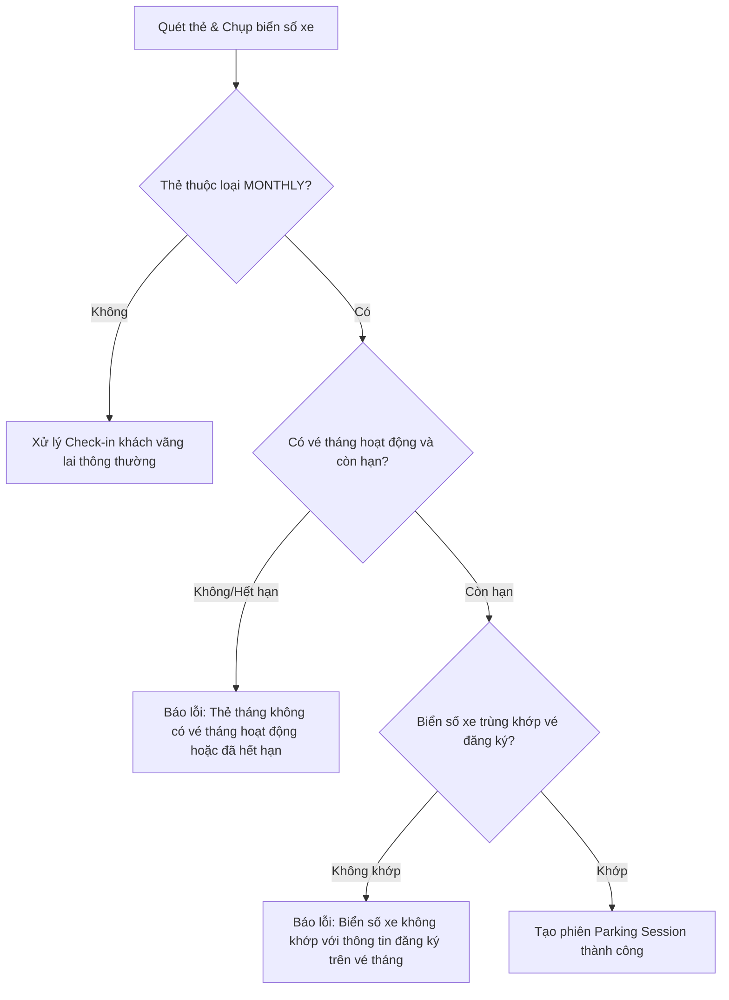

# Hướng dẫn Tích hợp API Vé Tháng (Monthly Ticket) dành cho Frontend

Tài liệu này cung cấp chi tiết về các API, cấu trúc Request/Response, cùng các quy tắc nghiệp vụ mới nhất liên quan đến chức năng **Vé tháng (Monthly Ticket)** và **Thẻ tháng (Monthly Card)** để lập trình viên Frontend tích hợp vào giao diện.

---

## 1. Danh sách API Vé Tháng (`/api/monthly-tickets`)

> [!IMPORTANT]
> Tất cả các API dưới đây yêu cầu header `Authorization: Bearer <Token>` của các tài khoản có quyền: `STAFF`, `MANAGER`, hoặc `ADMIN`. 
> Tài khoản có role `USER` thông thường không có quyền truy cập trực tiếp các API này (lỗi `403 Forbidden`).

### 1.1. Lấy danh sách Vé tháng (Có bộ lọc Branch)
* **Endpoint**: `GET /api/monthly-tickets`
* **Query Parameters**:
  * `branchId` (Long, optional): Lọc danh sách vé tháng theo ID chi nhánh.
* **Quy tắc phân quyền (Branch Scope)**:
  * **ADMIN**: Có thể xem toàn bộ hệ thống hoặc lọc theo `branchId` tùy ý.
  * **MANAGER / STAFF**: Chỉ được phép xem danh sách vé thuộc chi nhánh của mình. Nếu gửi lên `branchId` khác chi nhánh quản lý, hệ thống sẽ báo lỗi `403 Forbidden` hoặc thông báo không có quyền truy cập.
* **Cấu trúc Response (Mẫu JSON)**:
  ```json
  [
    {
      "ticketId": 1,
      "vehicleId": 12,
      "licensePlate": "30A-12345",
      "parkingCardId": 5,
      "cardCode": "MC0001",
      "guestName": "Nguyễn Văn A",
      "guestPhone": "0987654321",
      "startDate": "2026-07-01T00:00:00",
      "endDate": "2026-07-31T23:59:59",
      "parkingBranchId": 2,
      "parkingBranchName": "Chi nhánh Cầu Giấy",
      "status": 1
    }
  ]
  ```
  *(Lưu ý: Hai trường `parkingBranchId` và `parkingBranchName` mới được bổ sung để hiển thị rõ thông tin chi nhánh trên UI).*

### 1.2. Tạo mới Vé tháng
* **Endpoint**: `POST /api/monthly-tickets`
* **Request Body**:
  ```json
  {
    "vehicleId": 12,
    "parkingCardId": 5,
    "guestName": "Nguyễn Văn A",
    "guestPhone": "0987654321",
    "startDate": "2026-07-01T00:00:00",
    "endDate": "2026-07-31T23:59:59",
    "status": 1
  }
  ```
* **Các lỗi validate trả về từ Backend cần xử lý**:
  * **Ngày bắt đầu/kết thúc trống**: `"Ngày bắt đầu và ngày kết thúc không được để trống"`
  * **Ngày bắt đầu sau ngày kết thúc**: `"Ngày bắt đầu phải trước ngày kết thúc"`
  * **Thẻ không hợp lệ**: `"Chỉ cho phép thẻ giữ xe loại tháng (MONTHLY) đăng ký vé tháng"`
  * **Thẻ bị lỗi/khóa**: `"Thẻ giữ xe đang bị khóa hoặc báo mất"`
  * **Trùng lắp thông tin (Khi status = 1)**:
    * `"Phương tiện này đã đăng ký vé tháng hoạt động trong khoảng thời gian này"`
    * `"Thẻ này đã đăng ký vé tháng hoạt động trong khoảng thời gian này"`

### 1.3. Lấy chi tiết Vé tháng theo ID
* **Endpoint**: `GET /api/monthly-tickets/{id}`
* **Response**: Giống cấu trúc Response của danh sách (xem mục 1.1).
* **Quy tắc**: Nhân viên chỉ được xem chi tiết vé thuộc chi nhánh của mình.

### 1.4. Cập nhật thông tin Vé tháng
* **Endpoint**: `PUT /api/monthly-tickets/{id}`
* **Request Body**: (Có thể truyền các trường cần cập nhật)
  ```json
  {
    "vehicleId": 12,
    "parkingCardId": 5,
    "guestName": "Nguyễn Văn A (Đã cập nhật)",
    "guestPhone": "0987654321",
    "startDate": "2026-07-01T00:00:00",
    "endDate": "2026-07-31T23:59:59",
    "status": 1
  }
  ```
* **Quy tắc validate**: Áp dụng đầy đủ các bộ kiểm tra thời gian, loại thẻ, trạng thái thẻ và kiểm tra trùng lặp chu kỳ hoạt động tương tự API Tạo mới (loại trừ chính vé đang sửa).

### 1.5. Xóa Vé tháng
* **Endpoint**: `DELETE /api/monthly-tickets/{id}`
* **Quy tắc**: Nhân viên chỉ được xóa vé thuộc chi nhánh của mình.

---

## 2. Quy trình Check-in và Check-out với Thẻ Tháng

### 2.1. Quy trình Check-in
Khi Staff quét thẻ và chụp biển số xe tại máy Check-in (`POST /api/parking-sessions/guest/check-in`):



* **Yêu cầu giao diện Frontend**:
  * Khi API trả về lỗi biển số không khớp hoặc vé tháng hết hạn, hiển thị popup cảnh báo màu đỏ chi tiết lỗi để Staff yêu cầu khách hàng xuất trình giấy tờ hoặc thanh toán theo lượt khách vãng lai (nếu cần).
  * Chặn check-in đặt chỗ trước (Booking) đối với thẻ tháng: API `POST /api/parking-sessions/booking/check-in` sẽ trả về lỗi nếu quét bằng thẻ tháng: `"Thẻ tháng không thể sử dụng cho dịch vụ đặt chỗ (Booking)"`.

### 2.2. Quy trình Check-out & Tính phí
Khi Staff quét thẻ ra tại máy Check-out (`POST /api/parking-sessions/guest/check-out`):

1. **Backend tự động kiểm tra**: Nếu phiên gửi xe sử dụng thẻ tháng (`MONTHLY`) và thẻ đó đang có vé tháng hoạt động hợp lệ vào thời điểm đó, **Số tiền thanh toán sẽ bằng 0 VND** (`amount: 0.0`).
2. **Response mẫu khi checkout thẻ tháng**:
   ```json
   {
     "parkingSessionId": 99,
     "amount": 0.0,
     "paymentMethod": "CASH",
     "paymentId": 250,
     "paymentStatus": "PAID",
     "sessionStatus": "COMPLETED",
     "paymentUrl": null,
     "message": "Thanh toán tiền mặt thành công. Phiên gửi xe đã hoàn thành."
   }
   ```
* **Yêu cầu giao diện Frontend**:
  * Khi số tiền trả về bằng `0.0`, giao diện check-out của Staff nên tự động chọn phương thức tiền mặt (`CASH`), xác nhận thành công ngay lập tức và mở barrier mà không hiển thị màn hình yêu cầu thanh toán (hoặc hiển thị nhãn **"Miễn phí - Vé tháng"**).

---

## 3. Các mã lỗi thường gặp cần xử lý trên UI

| Mã lỗi HTTP | Nội dung thông báo lỗi (`message` từ API) | Gợi ý hiển thị trên giao diện |
| :--- | :--- | :--- |
| **400 Bad Request** | `Ngày bắt đầu phải trước ngày kết thúc` | Hiển thị thông báo lỗi ngay dưới ô nhập liệu ngày tháng. |
| **400 Bad Request** | `Chỉ cho phép thẻ giữ xe loại tháng (MONTHLY) đăng ký vé tháng` | Hiển thị cảnh báo khi chọn thẻ giữ xe trên form đăng ký vé tháng. |
| **400 Bad Request** | `Phương tiện này đã đăng ký vé tháng hoạt động trong khoảng thời gian này` | Hiển thị thông báo trùng lặp xe để nhân viên kiểm tra lại biển số/chọn chu kỳ khác. |
| **400 Bad Request** | `Thẻ này đã đăng ký vé tháng hoạt động trong khoảng thời gian này` | Hiển thị thông báo trùng lặp thẻ giữ xe. |
| **400 Bad Request** | `Thẻ tháng không có vé tháng hoạt động hoặc đã hết hạn` | Popup báo lỗi lớn tại màn hình Check-in. |
| **400 Bad Request** | `Biển số xe không khớp với thông tin đăng ký trên vé tháng` | Popup báo lỗi lớn màu đỏ tại màn hình Check-in (Rất quan trọng để tránh gian lận). |
| **403 Forbidden** | `Bạn không có quyền truy cập chi nhánh này` | Chuyển hướng người dùng về trang chủ hoặc thông báo không đủ thẩm quyền. |
