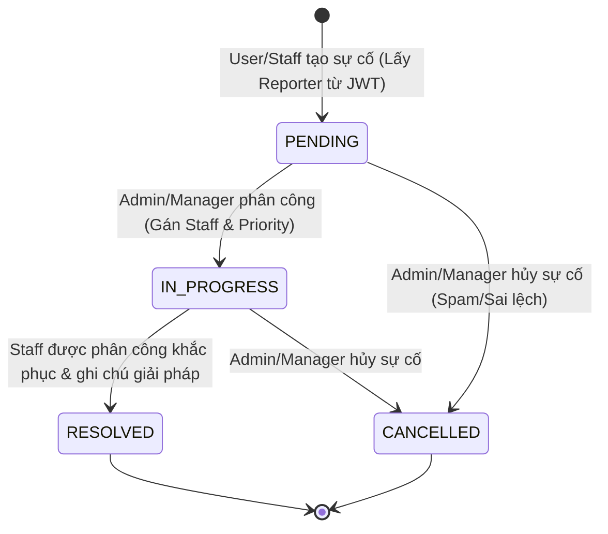
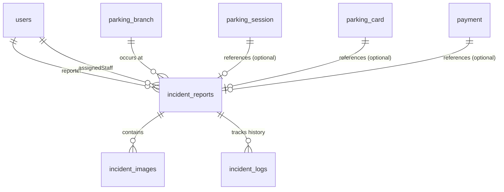

# Kế hoạch & Thiết kế Chức năng Báo cáo & Xử lý Sự cố (Incident Reporting & Management)

Tài liệu này trình bày chi tiết thiết kế hệ thống và kế hoạch triển khai chức năng **Báo cáo & Xử lý sự cố** của hệ thống quản lý bãi xe thông minh, đã được cải tiến và bổ sung dựa trên các phản hồi từ tài liệu review [incident_report_plan_review.md](file:///D:/Ki7/SWP391/Index/Index/docs/incident_report_plan_review.md).

---

## 1. Các Cải tiến nổi bật sau khi Review

Hệ thống quản lý sự cố được nâng cấp từ một cơ chế "ticket tĩnh" thông thường thành hệ thống **"ticket sự cố + nghiệp vụ tự động"**:

1.  **Bổ sung `IncidentType`:** Định nghĩa rõ ràng nhóm sự cố để áp dụng luồng nghiệp vụ tự động.
2.  **Tự động cập nhật Trạng thái Thẻ (`LOST_CARD` Workflow):** Khi tạo sự cố mất thẻ xe, hệ thống sẽ tự động đổi trạng thái thẻ liên quan sang `LOST` để tránh bị kẻ gian nhặt được và sử dụng.
3.  **Hỗ trợ Nhiều Hình ảnh (`IncidentImage`):** Thay vì một trường `imageUrl` duy nhất, hệ thống hỗ trợ lưu danh sách ảnh hiện trường (va quẹt, hỏng thiết bị, thẻ xe...) liên kết với Cloudinary.
4.  **Bản ghi Lịch sử Xử lý (`IncidentLog`):** Theo dõi chi tiết ai đã cập nhật sự cố vào lúc nào, từ trạng thái cũ sang trạng thái mới kèm mô tả cụ thể (Audit Log).
5.  **Bảo mật & Phân quyền:**
    - Không truyền `reporterId` trực tiếp qua Request API; thay vào đó, hệ thống sẽ tự động trích xuất thực thể `User` từ `SecurityContextHolder` (JWT Token).
    - Sử dụng `@PreAuthorize` để đảm bảo: Người dùng chỉ được xem sự cố của mình; Nhân viên chỉ được xử lý sự cố được phân công; Quản lý/Admin có toàn quyền phân công và điều phối.
6.  **Ràng buộc & Validate Dữ liệu:** Đảm bảo `ParkingSession` được báo cáo phải thuộc đúng `ParkingBranch` và xác thực phiên gửi xe liên quan.
7.  **Tách biệt Endpoints Nghiệp vụ:** Thay vì một hàm cập nhật chung chung, hệ thống cung cấp các endpoint riêng như `/lost-card`, `/{id}/assign`, `/{id}/resolve`, `/{id}/cancel`.

---

## 2. Quy trình & Nghiệp vụ Xử lý

### 2.1. Quy trình tổng quát (Incident Workflow)



### 2.2. Nghiệp vụ báo Mất thẻ xe (`LOST_CARD`)

Mất thẻ xe là một trường hợp nghiêm trọng ảnh hưởng trực tiếp đến tài sản khách hàng. Quy trình nghiệp vụ tự động hóa như sau:

1.  **Tiếp nhận báo cáo:** Khách hàng (hoặc nhân viên tạo hộ) gửi báo cáo loại `LOST_CARD` kèm theo biển số xe hoặc thông tin của phiên gửi xe `ParkingSession` đang hoạt động (`ACTIVE`).
2.  **Tự động khóa thẻ:** Hệ thống lập tức đổi trạng thái của `ParkingCard` tương ứng sang `LOST`.
3.  **Xác minh & Thanh toán:** Nhân viên đối chiếu ảnh chụp lúc check-in của xe để xác nhận đúng chủ sở hữu. Tiến hành lập hóa đơn thanh toán gồm **Phí gửi xe tích lũy + Phí đền bù mất thẻ**.
4.  **Hoàn thành:** Sau khi khách hàng thanh toán và nhận xe ra, phiên gửi xe `ParkingSession` được cập nhật thành đã thanh toán/check-out thủ công, đồng thời Ticket sự cố được chuyển sang trạng thái `RESOLVED`.

---

## 3. Thiết kế Cơ sở dữ liệu nâng cao (Database Design)



---

## 4. Chi tiết các File Code triển khai

### 4.1. Các Enums mới (`Parking.enums`)

#### [IncidentStatus.java](file:///D:/Ki7/SWP391/Index/Index/src/main/java/Parking/enums/IncidentStatus.java)

```java
package Parking.enums;

public enum IncidentStatus {
    PENDING,
    IN_PROGRESS,
    RESOLVED,
    CANCELLED
}
```

#### [IncidentPriority.java](file:///D:/Ki7/SWP391/Index/Index/src/main/java/Parking/enums/IncidentPriority.java)

```java
package Parking.enums;

public enum IncidentPriority {
    LOW,
    MEDIUM,
    HIGH,
    CRITICAL
}
```

#### [IncidentType.java](file:///D:/Ki7/SWP391/Index/Index/src/main/java/Parking/enums/IncidentType.java)

```java
package Parking.enums;

public enum IncidentType {
    LOST_CARD,         // Mất thẻ xe
    TECHNICAL_ERROR,   // Lỗi kỹ thuật (barrier, camera, đầu đọc thẻ...)
    PAYMENT_ERROR,     // Lỗi thanh toán trực tuyến/tiền mặt
    VEHICLE_DAMAGE,    // Xe bị va chạm, hư hại
    SECURITY_INCIDENT, // Trộm cắp, tranh chấp, mất an ninh
    POWER_OUTAGE,      // Mất điện toàn cục/một phần bãi xe
    BARRIER_ERROR,     // Barrier không mở
    OTHER              // Sự cố khác
}
```

---

### 4.2. Thực thể Entity (`Parking.Model`)

#### [IncidentReport.java](file:///D:/Ki7/SWP391/Index/Index/src/main/java/Parking/Model/IncidentReport.java)

```java
package Parking.Model;

import Parking.enums.IncidentPriority;
import Parking.enums.IncidentStatus;
import Parking.enums.IncidentType;
import jakarta.persistence.*;
import lombok.Getter;
import lombok.Setter;
import java.time.LocalDateTime;
import java.util.ArrayList;
import java.util.List;

@Entity
@Getter
@Setter
@Table(name = "incident_reports")
public class IncidentReport {

    @Id
    @GeneratedValue(strategy = GenerationType.IDENTITY)
    @Column(name = "incident_id")
    private Long incidentId;

    @Column(name = "title", nullable = false, columnDefinition = "nvarchar(255)")
    private String title;

    @Column(name = "description", nullable = false, columnDefinition = "nvarchar(max)")
    private String description;

    @Enumerated(EnumType.STRING)
    @Column(name = "incident_type", nullable = false)
    private IncidentType incidentType;

    @Enumerated(EnumType.STRING)
    @Column(name = "status", nullable = false)
    private IncidentStatus status = IncidentStatus.PENDING;

    @Enumerated(EnumType.STRING)
    @Column(name = "priority", nullable = false)
    private IncidentPriority priority = IncidentPriority.MEDIUM;

    @Column(name = "resolution_notes", columnDefinition = "nvarchar(max)")
    private String resolutionNotes;

    @Column(name = "created_at", nullable = false)
    private LocalDateTime createdAt = LocalDateTime.now();

    @Column(name = "updated_at")
    private LocalDateTime updatedAt;

    @Column(name = "resolved_at")
    private LocalDateTime resolvedAt;

    // Quan hệ với các thực thể
    @ManyToOne(fetch = FetchType.LAZY)
    @JoinColumn(name = "reporter_id", nullable = false)
    private User reporter;

    @ManyToOne(fetch = FetchType.LAZY)
    @JoinColumn(name = "assigned_staff_id")
    private User assignedStaff;

    @ManyToOne(fetch = FetchType.LAZY)
    @JoinColumn(name = "parking_branch_id", nullable = false)
    private ParkingBranch parkingBranch;

    @ManyToOne(fetch = FetchType.LAZY)
    @JoinColumn(name = "parking_session_id")
    private ParkingSession parkingSession;

    @ManyToOne(fetch = FetchType.LAZY)
    @JoinColumn(name = "parking_card_id")
    private ParkingCard parkingCard; // Thẻ xe liên quan (ví dụ trong case LOST_CARD)

    @ManyToOne(fetch = FetchType.LAZY)
    @JoinColumn(name = "payment_id")
    private Payment payment; // Hóa đơn đền bù hoặc giao dịch lỗi liên quan

    // Lịch sử cập nhật của Incident
    @OneToMany(mappedBy = "incidentReport", cascade = CascadeType.ALL, orphanRemoval = true)
    private List<IncidentLog> incidentLogs = new ArrayList<>();

    // Danh sách hình ảnh chứng minh đính kèm
    @OneToMany(mappedBy = "incidentReport", cascade = CascadeType.ALL, orphanRemoval = true)
    private List<IncidentImage> incidentImages = new ArrayList<>();

    public void addLog(IncidentLog log) {
        incidentLogs.add(log);
        log.setIncidentReport(this);
    }

    public void addImage(IncidentImage image) {
        incidentImages.add(image);
        image.setIncidentReport(this);
    }
}
```

#### [IncidentImage.java](file:///D:/Ki7/SWP391/Index/Index/src/main/java/Parking/Model/IncidentImage.java)

```java
package Parking.Model;

import jakarta.persistence.*;
import lombok.Getter;
import lombok.Setter;
import java.time.LocalDateTime;

@Entity
@Getter
@Setter
@Table(name = "incident_images")
public class IncidentImage {

    @Id
    @GeneratedValue(strategy = GenerationType.IDENTITY)
    @Column(name = "incident_image_id")
    private Long incidentImageId;

    @Column(name = "image_url", nullable = false, length = 1000)
    private String imageUrl;

    @Column(name = "public_id", nullable = false)
    private String publicId; // Dùng để xóa ảnh trên Cloudinary khi cần

    @Column(name = "uploaded_at", nullable = false)
    private LocalDateTime uploadedAt = LocalDateTime.now();

    @ManyToOne(fetch = FetchType.LAZY)
    @JoinColumn(name = "uploaded_by_id")
    private User uploadedBy;

    @ManyToOne(fetch = FetchType.LAZY)
    @JoinColumn(name = "incident_id", nullable = false)
    private IncidentReport incidentReport;
}
```

#### [IncidentLog.java](file:///D:/Ki7/SWP391/Index/Index/src/main/java/Parking/Model/IncidentLog.java)

```java
package Parking.Model;

import Parking.enums.IncidentStatus;
import jakarta.persistence.*;
import lombok.Getter;
import lombok.Setter;
import java.time.LocalDateTime;

@Entity
@Getter
@Setter
@Table(name = "incident_logs")
public class IncidentLog {

    @Id
    @GeneratedValue(strategy = GenerationType.IDENTITY)
    @Column(name = "log_id")
    private Long logId;

    @ManyToOne(fetch = FetchType.LAZY)
    @JoinColumn(name = "changed_by_id", nullable = false)
    private User changedBy; // Ai thực hiện cập nhật

    @Column(name = "changed_at", nullable = false)
    private LocalDateTime changedAt = LocalDateTime.now();

    @Enumerated(EnumType.STRING)
    @Column(name = "old_status")
    private IncidentStatus oldStatus;

    @Enumerated(EnumType.STRING)
    @Column(name = "new_status")
    private IncidentStatus newStatus;

    @Column(name = "description", nullable = false, columnDefinition = "nvarchar(max)")
    private String description; // Chi tiết thao tác (ví dụ: "Phân công xử lý cho Staff A")

    @ManyToOne(fetch = FetchType.LAZY)
    @JoinColumn(name = "incident_id", nullable = false)
    private IncidentReport incidentReport;
}
```

---

### 4.3. DTO Requests & Responses (`Parking.dto`)

#### [CreateIncidentRequest.java](file:///D:/Ki7/SWP391/Index/Index/src/main/java/Parking/dto/request/CreateIncidentRequest.java)

```java
package Parking.dto.request;

import Parking.enums.IncidentPriority;
import Parking.enums.IncidentType;
import jakarta.validation.constraints.NotBlank;
import jakarta.validation.constraints.NotNull;
import lombok.Getter;
import lombok.Setter;
import java.util.List;

@Getter
@Setter
public class CreateIncidentRequest {
    @NotBlank(message = "Tiêu đề không được để trống")
    private String title;

    @NotBlank(message = "Mô tả chi tiết không được để trống")
    private String description;

    @NotNull(message = "Loại sự cố là bắt buộc")
    private IncidentType incidentType;

    private Long parkingBranchId; // Có thể suy ra từ session nếu có session

    private Long parkingSessionId; // Không bắt buộc (VD: sự cố mất thẻ xe, hoặc lỗi barrier)

    private Long parkingCardId; // ID thẻ xe bị mất (nếu báo mất thẻ)

    private IncidentPriority priority = IncidentPriority.MEDIUM;

    private List<ImageDto> images; // List các URL và publicId đã upload lên Cloudinary trước đó

    @Getter
    @Setter
    public static class ImageDto {
        private String imageUrl;
        private String publicId;
    }
}
```

#### [LostCardIncidentRequest.java](file:///D:/Ki7/SWP391/Index/Index/src/main/java/Parking/dto/request/LostCardIncidentRequest.java)

```java
package Parking.dto.request;

import jakarta.validation.constraints.NotBlank;
import jakarta.validation.constraints.NotNull;
import lombok.Getter;
import lombok.Setter;

@Getter
@Setter
public class LostCardIncidentRequest {
    @NotBlank(message = "Lý do/Mô tả báo mất thẻ không được để trống")
    private String description;

    @NotBlank(message = "Mã số thẻ báo mất không được để trống")
    private String cardCode;

    @NotNull(message = "Phiên giữ xe hiện tại của xe không được để trống")
    private Long parkingSessionId;
}
```

#### [AssignIncidentRequest.java](file:///D:/Ki7/SWP391/Index/Index/src/main/java/Parking/dto/request/AssignIncidentRequest.java)

```java
package Parking.dto.request;

import Parking.enums.IncidentPriority;
import jakarta.validation.constraints.NotNull;
import lombok.Getter;
import lombok.Setter;

@Getter
@Setter
public class AssignIncidentRequest {
    @NotNull(message = "ID nhân viên phân công xử lý là bắt buộc")
    private Long assignedStaffId;

    private IncidentPriority priority;
}
```

#### [ResolveIncidentRequest.java](file:///D:/Ki7/SWP391/Index/Index/src/main/java/Parking/dto/request/ResolveIncidentRequest.java)

```java
package Parking.dto.request;

import jakarta.validation.constraints.NotBlank;
import lombok.Getter;
import lombok.Setter;

@Getter
@Setter
public class ResolveIncidentRequest {
    @NotBlank(message = "Ghi chú khắc phục sự cố không được để trống khi hoàn thành")
    private String resolutionNotes;
}
```

#### [IncidentReportResponse.java](file:///D:/Ki7/SWP391/Index/Index/src/main/java/Parking/dto/response/IncidentReportResponse.java)

```java
package Parking.dto.response;

import Parking.enums.IncidentPriority;
import Parking.enums.IncidentStatus;
import Parking.enums.IncidentType;
import lombok.Builder;
import lombok.Getter;
import lombok.Setter;
import java.time.LocalDateTime;
import java.util.List;

@Getter
@Setter
@Builder
public class IncidentReportResponse {
    private Long incidentId;
    private String title;
    private String description;
    private IncidentType incidentType;
    private IncidentStatus status;
    private IncidentPriority priority;
    private String resolutionNotes;
    private LocalDateTime createdAt;
    private LocalDateTime updatedAt;
    private LocalDateTime resolvedAt;

    private Long reporterId;
    private String reporterName;
    private String reporterPhone;

    private Long assignedStaffId;
    private String assignedStaffName;

    private Long parkingBranchId;
    private String parkingBranchName;

    private Long parkingSessionId;
    private Long parkingCardId;
    private String cardCode;

    private List<IncidentImageResponse> images;
    private List<IncidentLogResponse> logs;

    @Getter
    @Setter
    @Builder
    public static class IncidentImageResponse {
        private Long incidentImageId;
        private String imageUrl;
        private LocalDateTime uploadedAt;
    }

    @Getter
    @Setter
    @Builder
    public static class IncidentLogResponse {
        private Long logId;
        private String changedByName;
        private LocalDateTime changedAt;
        private IncidentStatus oldStatus;
        private IncidentStatus newStatus;
        private String description;
    }
}
```

---

### 4.4. Repository (`Parking.Repository`)

#### [IncidentReportRepository.java](file:///D:/Ki7/SWP391/Index/Index/src/main/java/Parking/Repository/IncidentReportRepository.java)

```java
package Parking.Repository;

import Parking.Model.IncidentReport;
import Parking.enums.IncidentStatus;
import org.springframework.data.jpa.repository.JpaRepository;
import org.springframework.data.jpa.repository.Query;
import org.springframework.data.repository.query.Param;
import org.springframework.stereotype.Repository;
import java.util.List;

@Repository
public interface IncidentReportRepository extends JpaRepository<IncidentReport, Long> {
    List<IncidentReport> findByParkingBranchParkingBranchId(Long branchId);

    @Query("SELECT ir FROM IncidentReport ir WHERE ir.reporter.userId = :userId OR ir.assignedStaff.userId = :userId")
    List<IncidentReport> findByInvolvedUserId(@Param("userId") Long userId);

    List<IncidentReport> findByReporterUserId(Long reporterId);
    List<IncidentReport> findByAssignedStaffUserId(Long staffId);
    List<IncidentReport> findByStatus(IncidentStatus status);
}
```

#### [IncidentImageRepository.java](file:///D:/Ki7/SWP391/Index/Index/src/main/java/Parking/Repository/IncidentImageRepository.java)

```java
package Parking.Repository;

import Parking.Model.IncidentImage;
import org.springframework.data.jpa.repository.JpaRepository;
import org.springframework.stereotype.Repository;

@Repository
public interface IncidentImageRepository extends JpaRepository<IncidentImage, Long> {
}
```

#### [IncidentLogRepository.java](file:///D:/Ki7/SWP391/Index/Index/src/main/java/Parking/Repository/IncidentLogRepository.java)

```java
package Parking.Repository;

import Parking.Model.IncidentLog;
import org.springframework.data.jpa.repository.JpaRepository;
import org.springframework.stereotype.Repository;

@Repository
public interface IncidentLogRepository extends JpaRepository<IncidentLog, Long> {
}
```

---

### 4.5. Service Business Logic (`Parking.Service`)

#### [IncidentReportService.java](file:///D:/Ki7/SWP391/Index/Index/src/main/java/Parking/Service/IncidentReportService.java)

```java
package Parking.Service;

import Parking.Model.*;
import Parking.Repository.*;
import Parking.dto.request.*;
import Parking.dto.response.IncidentReportResponse;
import Parking.enums.*;
import Parking.exception.exceptions.ParkingSessionException;
import lombok.RequiredArgsConstructor;
import org.springframework.security.core.context.SecurityContextHolder;
import org.springframework.stereotype.Service;
import org.springframework.transaction.annotation.Transactional;
import java.time.LocalDateTime;
import java.util.List;

@Service
@RequiredArgsConstructor
public class IncidentReportService {

    private final IncidentReportRepository incidentReportRepository;
    private final UserRepository userRepository;
    private final ParkingBranchRepository parkingBranchRepository;
    private final ParkingSessionRepository parkingSessionRepository;
    private final ParkingCardRepository parkingCardRepository;

    // Helper trích xuất User hiện tại đang đăng nhập từ Security Context (JWT Filter lưu User entity)
    public User getCurrentUser() {
        Object principal = SecurityContextHolder.getContext().getAuthentication().getPrincipal();
        if (principal instanceof User) {
            return (User) principal;
        }
        throw new ParkingSessionException("Yêu cầu xác thực tài khoản!");
    }

    @Transactional
    public IncidentReportResponse createReport(CreateIncidentRequest request) {
        User reporter = getCurrentUser();
        ParkingBranch branch = null;
        ParkingSession session = null;

        // 1. Kiểm tra logic ParkingSession và ParkingBranch tương ứng
        if (request.getParkingSessionId() != null) {
            session = parkingSessionRepository.findById(request.getParkingSessionId())
                    .orElseThrow(() -> new ParkingSessionException("Không tìm thấy phiên giữ xe liên quan"));

            branch = session.getParkingBranch(); // Lấy branch trực tiếp từ session để chống bất nhất dữ liệu

            if (request.getParkingBranchId() != null && !request.getParkingBranchId().equals(branch.getParkingBranchId())) {
                throw new ParkingSessionException("Chi nhánh gửi xe không khớp với phiên gửi xe tương ứng");
            }
        } else {
            if (request.getParkingBranchId() == null) {
                throw new ParkingSessionException("Yêu cầu cung cấp chi nhánh xảy ra sự cố!");
            }
            branch = parkingBranchRepository.findById(request.getParkingBranchId())
                    .orElseThrow(() -> new ParkingSessionException("Không tìm thấy chi nhánh bãi xe"));
        }

        if (!branch.isActive()) {
            throw new ParkingSessionException("Chi nhánh bãi xe này hiện tại đang ngừng hoạt động!");
        }

        // 2. Map dữ liệu IncidentReport
        IncidentReport report = new IncidentReport();
        report.setTitle(request.getTitle());
        report.setDescription(request.getDescription());
        report.setIncidentType(request.getIncidentType());
        report.setPriority(request.getPriority());
        report.setStatus(IncidentStatus.PENDING);
        report.setReporter(reporter);
        report.setParkingBranch(branch);
        report.setParkingSession(session);
        report.setCreatedAt(LocalDateTime.now());

        // Báo mất thẻ xe: Thiết lập mối quan hệ thẻ và tự động đổi thẻ sang trạng thái LOST
        if (request.getIncidentType() == IncidentType.LOST_CARD) {
            if (request.getParkingCardId() == null && session != null) {
                report.setParkingCard(session.getParkingCard());
            } else if (request.getParkingCardId() != null) {
                ParkingCard card = parkingCardRepository.findById(request.getParkingCardId())
                        .orElseThrow(() -> new ParkingSessionException("Không tìm thấy thẻ giữ xe"));
                report.setParkingCard(card);
            }

            if (report.getParkingCard() != null) {
                report.getParkingCard().setStatus(ParkingCardStatus.LOST);
            } else {
                throw new ParkingSessionException("Cần cung cấp thông tin thẻ xe để báo mất thẻ!");
            }
        }

        // 3. Thêm ảnh (nếu có)
        if (request.getImages() != null) {
            for (CreateIncidentRequest.ImageDto imgDto : request.getImages()) {
                IncidentImage img = new IncidentImage();
                img.setImageUrl(imgDto.getImageUrl());
                img.setPublicId(imgDto.getPublicId());
                img.setUploadedBy(reporter);
                img.setUploadedAt(LocalDateTime.now());
                report.addImage(img);
            }
        }

        // 4. Tạo Log bắt đầu
        IncidentLog initialLog = new IncidentLog();
        initialLog.setChangedBy(reporter);
        initialLog.setChangedAt(LocalDateTime.now());
        initialLog.setOldStatus(null);
        initialLog.setNewStatus(IncidentStatus.PENDING);
        initialLog.setDescription("Sự cố đã được khởi tạo bởi " + reporter.getUserFullName());
        report.addLog(initialLog);

        return convertToResponse(incidentReportRepository.save(report));
    }

    @Transactional
    public IncidentReportResponse reportLostCard(LostCardIncidentRequest request) {
        User reporter = getCurrentUser();

        ParkingSession session = parkingSessionRepository.findById(request.getParkingSessionId())
                .orElseThrow(() -> new ParkingSessionException("Không tìm thấy phiên giữ xe đang hoạt động"));

        if (session.getStatus() != ParkingSessionStatus.ACTIVE) {
            throw new ParkingSessionException("Phiên giữ xe này đã kết thúc, không thể báo mất thẻ!");
        }

        ParkingCard card = session.getParkingCard();
        if (card == null || !card.getCardCode().equalsIgnoreCase(request.getCardCode())) {
            throw new ParkingSessionException("Thẻ xe không trùng khớp với phiên gửi xe hiện tại!");
        }

        // Khóa thẻ lập tức
        card.setStatus(ParkingCardStatus.LOST);
        parkingCardRepository.save(card);

        // Tạo Incident ticket tự động
        IncidentReport report = new IncidentReport();
        report.setTitle("Khách hàng báo mất thẻ: " + card.getCardCode());
        report.setDescription(request.getDescription());
        report.setIncidentType(IncidentType.LOST_CARD);
        report.setPriority(IncidentPriority.HIGH);
        report.setStatus(IncidentStatus.PENDING);
        report.setReporter(reporter);
        report.setParkingBranch(session.getParkingBranch());
        report.setParkingSession(session);
        report.setParkingCard(card);
        report.setCreatedAt(LocalDateTime.now());

        // Ghi Log Audit
        IncidentLog log = new IncidentLog();
        log.setChangedBy(reporter);
        log.setChangedAt(LocalDateTime.now());
        log.setNewStatus(IncidentStatus.PENDING);
        log.setDescription("Khách hàng báo mất thẻ. Thẻ " + card.getCardCode() + " đã tự động bị khóa sang LOST.");
        report.addLog(log);

        return convertToResponse(incidentReportRepository.save(report));
    }

    @Transactional
    public IncidentReportResponse assignIncident(Long id, AssignIncidentRequest request) {
        User operator = getCurrentUser();
        IncidentReport report = incidentReportRepository.findById(id)
                .orElseThrow(() -> new ParkingSessionException("Không tìm thấy báo cáo sự cố"));

        // Kiểm soát chuyển trạng thái
        if (report.getStatus() == IncidentStatus.RESOLVED || report.getStatus() == IncidentStatus.CANCELLED) {
            throw new ParkingSessionException("Không thể phân công công việc cho sự cố đã đóng hoặc đã hủy");
        }

        User staff = userRepository.findById(request.getAssignedStaffId())
                .orElseThrow(() -> new ParkingSessionException("Không tìm thấy nhân viên được phân công"));

        if (staff.getUserRole() != UserRole.STAFF && staff.getUserRole() != UserRole.MANAGER) {
            throw new ParkingSessionException("Người nhận phân công phải là Nhân viên hoặc Quản lý");
        }

        IncidentStatus oldStatus = report.getStatus();
        report.setAssignedStaff(staff);
        report.setStatus(IncidentStatus.IN_PROGRESS);
        if (request.getPriority() != null) {
            report.setPriority(request.getPriority());
        }
        report.setUpdatedAt(LocalDateTime.now());

        // Ghi log
        IncidentLog log = new IncidentLog();
        log.setChangedBy(operator);
        log.setChangedAt(LocalDateTime.now());
        log.setOldStatus(oldStatus);
        log.setNewStatus(IncidentStatus.IN_PROGRESS);
        log.setDescription("Phân công sự cố cho nhân viên: " + staff.getUserFullName() + " (Độ ưu tiên: " + report.getPriority() + ")");
        report.addLog(log);

        return convertToResponse(incidentReportRepository.save(report));
    }

    @Transactional
    public IncidentReportResponse resolveIncident(Long id, ResolveIncidentRequest request) {
        User staff = getCurrentUser();
        IncidentReport report = incidentReportRepository.findById(id)
                .orElseThrow(() -> new ParkingSessionException("Không tìm thấy báo cáo sự cố"));

        // Kiểm soát phân quyền: Chỉ Staff được giao hoặc Admin/Manager được phép hoàn thành
        if (staff.getUserRole() == UserRole.STAFF &&
            (report.getAssignedStaff() == null || !report.getAssignedStaff().getUserId().equals(staff.getUserId()))) {
            throw new ParkingSessionException("Bạn không phải nhân viên được giao trách nhiệm giải quyết sự cố này!");
        }

        if (report.getStatus() == IncidentStatus.RESOLVED) {
            throw new ParkingSessionException("Sự cố đã được đánh dấu hoàn thành từ trước");
        }

        IncidentStatus oldStatus = report.getStatus();
        report.setStatus(IncidentStatus.RESOLVED);
        report.setResolutionNotes(request.getResolutionNotes());
        report.setResolvedAt(LocalDateTime.now());
        report.setUpdatedAt(LocalDateTime.now());

        // Ghi log
        IncidentLog log = new IncidentLog();
        log.setChangedBy(staff);
        log.setChangedAt(LocalDateTime.now());
        log.setOldStatus(oldStatus);
        log.setNewStatus(IncidentStatus.RESOLVED);
        log.setDescription("Sự cố được giải quyết xong bởi " + staff.getUserFullName() + ". Ghi chú: " + request.getResolutionNotes());
        report.addLog(log);

        return convertToResponse(incidentReportRepository.save(report));
    }

    @Transactional
    public IncidentReportResponse cancelIncident(Long id, String reason) {
        User operator = getCurrentUser();
        IncidentReport report = incidentReportRepository.findById(id)
                .orElseThrow(() -> new ParkingSessionException("Không tìm thấy báo cáo sự cố"));

        if (report.getStatus() == IncidentStatus.RESOLVED) {
            throw new ParkingSessionException("Không thể hủy sự cố đã được khắc phục hoàn tất!");
        }

        IncidentStatus oldStatus = report.getStatus();
        report.setStatus(IncidentStatus.CANCELLED);
        report.setResolutionNotes("Bị hủy: " + reason);
        report.setUpdatedAt(LocalDateTime.now());

        // Ghi log
        IncidentLog log = new IncidentLog();
        log.setChangedBy(operator);
        log.setChangedAt(LocalDateTime.now());
        log.setOldStatus(oldStatus);
        log.setNewStatus(IncidentStatus.CANCELLED);
        log.setDescription("Hủy sự cố do: " + reason);
        report.addLog(log);

        return convertToResponse(incidentReportRepository.save(report));
    }

    @Transactional(readOnly = true)
    public List<IncidentReportResponse> getMyIncidents() {
        User user = getCurrentUser();
        if (user.getUserRole() == UserRole.ADMIN || user.getUserRole() == UserRole.MANAGER) {
            return incidentReportRepository.findAll().stream().map(this::convertToResponse).toList();
        }
        return incidentReportRepository.findByInvolvedUserId(user.getUserId()).stream()
                .map(this::convertToResponse)
                .toList();
    }

    @Transactional(readOnly = true)
    public IncidentReportResponse getReportById(Long id) {
        User user = getCurrentUser();
        IncidentReport report = incidentReportRepository.findById(id)
                .orElseThrow(() -> new ParkingSessionException("Không tìm thấy báo cáo sự cố"));

        // Bảo mật phân quyền truy xuất thông tin
        if (user.getUserRole() == UserRole.USER && !report.getReporter().getUserId().equals(user.getUserId())) {
            throw new ParkingSessionException("Bạn không có quyền xem thông tin sự cố của người khác!");
        }

        return convertToResponse(report);
    }

    private IncidentReportResponse convertToResponse(IncidentReport report) {
        List<IncidentReportResponse.IncidentImageResponse> imgs = report.getIncidentImages().stream()
                .map(i -> IncidentReportResponse.IncidentImageResponse.builder()
                        .incidentImageId(i.getIncidentImageId())
                        .imageUrl(i.getImageUrl())
                        .uploadedAt(i.getUploadedAt())
                        .build())
                .toList();

        List<IncidentReportResponse.IncidentLogResponse> logs = report.getIncidentLogs().stream()
                .map(l -> IncidentReportResponse.IncidentLogResponse.builder()
                        .logId(l.getLogId())
                        .changedByName(l.getChangedBy().getUserFullName())
                        .changedAt(l.getChangedAt())
                        .oldStatus(l.getOldStatus())
                        .newStatus(l.getNewStatus())
                        .description(l.getDescription())
                        .build())
                .toList();

        return IncidentReportResponse.builder()
                .incidentId(report.getIncidentId())
                .title(report.getTitle())
                .description(report.getDescription())
                .incidentType(report.getIncidentType())
                .status(report.getStatus())
                .priority(report.getPriority())
                .resolutionNotes(report.getResolutionNotes())
                .createdAt(report.getCreatedAt())
                .updatedAt(report.getUpdatedAt())
                .resolvedAt(report.getResolvedAt())
                .reporterId(report.getReporter().getUserId())
                .reporterName(report.getReporter().getUserFullName())
                .reporterPhone(report.getReporter().getUserPhone())
                .assignedStaffId(report.getAssignedStaff() != null ? report.getAssignedStaff().getUserId() : null)
                .assignedStaffName(report.getAssignedStaff() != null ? report.getAssignedStaff().getUserFullName() : null)
                .parkingBranchId(report.getParkingBranch().getParkingBranchId())
                .parkingBranchName(report.getParkingBranch().getBranchName())
                .parkingSessionId(report.getParkingSession() != null ? report.getParkingSession().getParkingSessionId() : null)
                .parkingCardId(report.getParkingCard() != null ? report.getParkingCard().getParkingCardId() : null)
                .cardCode(report.getParkingCard() != null ? report.getParkingCard().getCardCode() : null)
                .images(imgs)
                .logs(logs)
                .build();
    }
}
```

---

### 4.6. REST Controller (`Parking.Controller`)

#### [IncidentReportController.java](file:///D:/Ki7/SWP391/Index/Index/src/main/java/Parking/Controller/IncidentReportController.java)

```java
package Parking.Controller;

import Parking.Service.IncidentReportService;
import Parking.dto.request.*;
import Parking.dto.response.IncidentReportResponse;
import io.swagger.v3.oas.annotations.Operation;
import io.swagger.v3.oas.annotations.tags.Tag;
import jakarta.validation.Valid;
import lombok.RequiredArgsConstructor;
import org.springframework.http.ResponseEntity;
import org.springframework.security.access.prepost.PreAuthorize;
import org.springframework.web.bind.annotation.*;
import java.util.List;

@RestController
@RequestMapping("/api/incidents")
@RequiredArgsConstructor
@CrossOrigin("*")
@Tag(name = "Incident Report Controller", description = "Quản lý báo cáo và xử lý sự cố nâng cao")
public class IncidentReportController {

    private final IncidentReportService incidentReportService;

    @PostMapping
    @Operation(summary = "Tạo báo cáo sự cố chung")
    @PreAuthorize("hasAnyRole('USER', 'STAFF', 'MANAGER', 'ADMIN')")
    public ResponseEntity<IncidentReportResponse> createReport(
            @Valid @RequestBody CreateIncidentRequest request
    ) {
        return ResponseEntity.ok(incidentReportService.createReport(request));
    }

    @PostMapping("/lost-card")
    @Operation(summary = "Nghiệp vụ đặc thù: Báo mất thẻ giữ xe (Tự động khóa thẻ)")
    @PreAuthorize("hasAnyRole('USER', 'STAFF', 'MANAGER', 'ADMIN')")
    public ResponseEntity<IncidentReportResponse> reportLostCard(
            @Valid @RequestBody LostCardIncidentRequest request
    ) {
        return ResponseEntity.ok(incidentReportService.reportLostCard(request));
    }

    @PutMapping("/{id}/assign")
    @Operation(summary = "Phân công nhân viên xử lý sự cố")
    @PreAuthorize("hasAnyRole('MANAGER', 'ADMIN')")
    public ResponseEntity<IncidentReportResponse> assignIncident(
            @PathVariable Long id,
            @Valid @RequestBody AssignIncidentRequest request
    ) {
        return ResponseEntity.ok(incidentReportService.assignIncident(id, request));
    }

    @PutMapping("/{id}/resolve")
    @Operation(summary = "Cập nhật hoàn tất khắc phục sự cố")
    @PreAuthorize("hasAnyRole('STAFF', 'MANAGER', 'ADMIN')")
    public ResponseEntity<IncidentReportResponse> resolveIncident(
            @PathVariable Long id,
            @Valid @RequestBody ResolveIncidentRequest request
    ) {
        return ResponseEntity.ok(incidentReportService.resolveIncident(id, request));
    }

    @PutMapping("/{id}/cancel")
    @Operation(summary = "Hủy báo cáo sự cố (do thông tin sai lệch/spam)")
    @PreAuthorize("hasAnyRole('MANAGER', 'ADMIN')")
    public ResponseEntity<IncidentReportResponse> cancelIncident(
            @PathVariable Long id,
            @RequestParam String reason
    ) {
        return ResponseEntity.ok(incidentReportService.cancelIncident(id, reason));
    }

    @GetMapping("/my-incidents")
    @Operation(summary = "Lấy danh sách sự cố liên quan đến người đăng nhập")
    @PreAuthorize("hasAnyRole('USER', 'STAFF', 'MANAGER', 'ADMIN')")
    public ResponseEntity<List<IncidentReportResponse>> getMyIncidents() {
        return ResponseEntity.ok(incidentReportService.getMyIncidents());
    }

    @GetMapping("/{id}")
    @Operation(summary = "Xem chi tiết sự cố theo ID")
    @PreAuthorize("hasAnyRole('USER', 'STAFF', 'MANAGER', 'ADMIN')")
    public ResponseEntity<IncidentReportResponse> getReportById(@PathVariable Long id) {
        return ResponseEntity.ok(incidentReportService.getReportById(id));
    }
}
```
